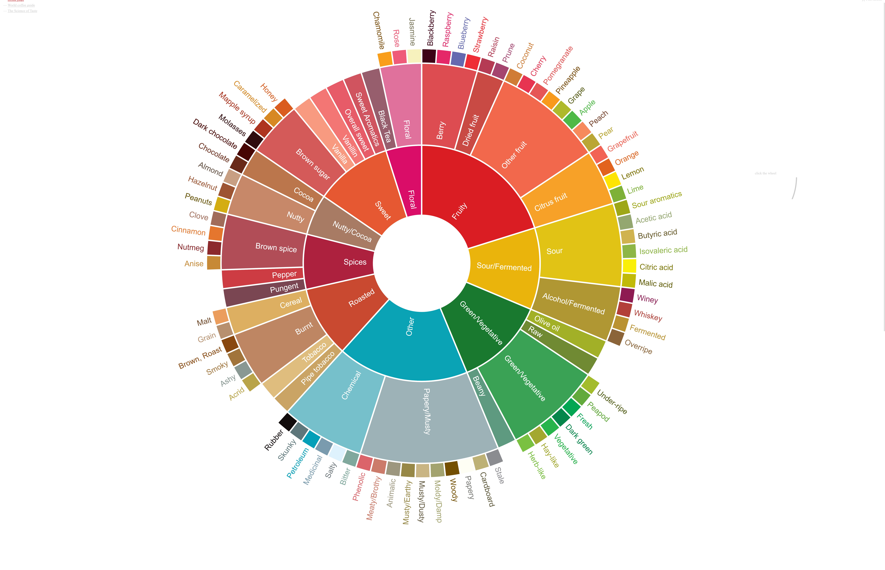

# WCR Sensory Lexicon Sample Data in RDF Turtle

This document presents a subset of the World Coffee Research (WCR) Sensory Lexicon data, extracted to reflect the hierarchical structure of the Specialty Coffee Association (SCA) Coffee Taster’s Flavor Wheel, and represented in RDF Turtle (TTL) format. The WCR Sensory Lexicon, developed by WCR and Kansas State University, defines 110 flavor, aroma, and texture attributes with references and intensity scores (1–15 scale). The flavor wheel, derived from the lexicon, organizes these attributes hierarchically, with broad categories (e.g., "Fruity") and specific descriptors (e.g., "Blackberry"). This sample data integrates with the corrected coffee ontologies (`coffee.ttl`, `Beans.ttl`, `Shops.ttl`) from [KG4Coffee](https://github.com/MehranDHN/KG4Coffee), enhancing their sensory modeling for GraphDB applications like quality analysis and personalized recommendations.



Interactive version available in [notbadcoffee.com](https://notbadcoffee.com/flavor-wheel-en/).

## Overview
- **Purpose**: Extract a representative subset of the WCR Sensory Lexicon to demonstrate its integration with the coffee ontologies, focusing on the flavor wheel’s hierarchy.
- **Scope**:
  - **Flavors**: "Fruity" (Blackberry, Pineapple), "Nutty/Cocoa" (Hazelnut, Chocolate).
  - **Aromas**: "Floral" (Jasmine), "Roasted" (Smoky).
  - **Textures**: Syrupy, Creamy.
  - **Attributes**: Hierarchy, definitions, references, intensity scores.
  - **Instances**: Example bean (`EthiopianTypicaBean`) and drink (`Espresso`).
- **Alignment**: Extends `coffee.ttl`’s `Flavor` class with `Aroma`, `Texture`, `SensoryReference`, and properties (`hasIntensity`, `hasReference`).
- **Output**: Turtle code block with classes, properties, and individuals, compatible with GraphDB.

## Sample Data Extraction
- **Source**: WCR Sensory Lexicon (version 2.0, 2017), basis for the SCA Flavor Wheel.
- **Selection Criteria**:
  - Chose prominent flavor wheel categories ("Fruity", "Nutty/Cocoa") and descriptors to reflect hierarchy.
  - Included aromas and textures to capture the lexicon’s scope.
  - Selected references (e.g., Smucker’s Blackberry Jam, FlavorActiV capsules) for standardization.
  - Assigned sample intensity scores based on lexicon examples (e.g., Blackberry at 5.5).
- **Flavor Wheel Connection**:
  - The wheel’s 9 top-level categories (e.g., "Fruity") and nested descriptors (e.g., "Berry" → "Blackberry") mirror the lexicon’s structure.
  - Sample data models this hierarchy using OWL classes (e.g., `Fruity` → `Blackberry`).
- **Ontology Integration**:
  - Uses `coffee:` namespace (`http://www.example.org/coffee#`).
  - Aligns with `coffee:Flavor`, `coffee:CoffeeBean`, `coffee:CoffeeDrink`.
  - Adds proposed classes/properties from prior analysis (`Aroma`, `Texture`, `hasIntensity`).

## Turtle Representation
The following Turtle code defines the sample lexicon data, including:
- **Classes**: Hierarchical flavor, aroma, and texture classes.
- **Properties**: `hasIntensity`, `hasReference`, `hasAroma`, `hasTexture`.
- **Individuals**: Sensory attributes, references, and example bean/drink.

```turtle
@prefix coffee: <http://www.example.org/coffee#> .
@prefix beans: <http://www.example.org/beans#> .
@prefix shops: <http://www.example.org/shops#> .
@prefix rdf: <http://www.w3.org/1999/02/22-rdf-syntax-ns#> .
@prefix rdfs: <http://www.w3.org/2000/01/rdf-schema#> .
@prefix owl: <http://www.w3.org/2002/07/owl#> .
@prefix xsd: <http://www.w3.org/2001/XMLSchema#> .

# Classes
coffee:Flavor a owl:Class ;
    rdfs:label "Flavor"@en ;
    rdfs:comment "Sensory flavor attributes of coffee, per WCR Sensory Lexicon."@en .

coffee:Fruity a owl:Class ;
    rdfs:subClassOf coffee:Flavor ;
    rdfs:label "Fruity Flavor"@en ;
    rdfs:comment "A flavor category with fruit-like notes, per WCR Lexicon."@en .

coffee:Blackberry a owl:Class ;
    rdfs:subClassOf coffee:Fruity ;
    rdfs:label "Blackberry Flavor"@en ;
    rdfs:comment "Sweet, dark, fruity, floral, slightly sour flavor, per WCR Lexicon."@en .

coffee:Pineapple a owl:Class ;
    rdfs:subClassOf coffee:Fruity ;
    rdfs:label "Pineapple Flavor"@en ;
    rdfs:comment "Sweet, tropical, tangy flavor, per WCR Lexicon."@en .

coffee:NuttyCocoa a owl:Class ;
    rdfs:subClassOf coffee:Flavor ;
    rdfs:label "Nutty/Cocoa Flavor"@en ;
    rdfs:comment "A flavor category with nutty or cocoa-like notes, per WCR Lexicon."@en .

coffee:Hazelnut a owl:Class ;
    rdfs:subClassOf coffee:NuttyCocoa ;
    rdfs:label "Hazelnut Flavor"@en ;
    rdfs:comment "Rich, buttery, nutty flavor, per WCR Lexicon."@en .

coffee:Chocolate a owl:Class ;
    rdfs:subClassOf coffee:NuttyCocoa ;
    rdfs:label "Chocolate Flavor"@en ;
    rdfs:comment "Sweet, cocoa-like flavor, per WCR Lexicon."@en .

coffee:Aroma a owl:Class ;
    rdfs:label "Aroma"@en ;
    rdfs:comment "Sensory aroma attributes of coffee, per WCR Sensory Lexicon."@en .

coffee:FloralAroma a owl:Class ;
    rdfs:subClassOf coffee:Aroma ;
    rdfs:label "Floral Aroma"@en ;
    rdfs:comment "An aroma category with flower-like notes, per WCR Lexicon."@en .

coffee:Jasmine a owl:Class ;
    rdfs:subClassOf coffee:FloralAroma ;
    rdfs:label "Jasmine Aroma"@en ;
    rdfs:comment "Sweet, floral aroma, per WCR Lexicon."@en .

coffee:RoastedAroma a owl:Class ;
    rdfs:subClassOf coffee:Aroma ;
    rdfs:label "Roasted Aroma"@en ;
    rdfs:comment "An aroma category with roasted notes, per WCR Lexicon."@en .

coffee:Smoky a owl:Class ;
    rdfs:subClassOf coffee:RoastedAroma ;
    rdfs:label "Smoky Aroma"@en ;
    rdfs:comment "Dark, burnt, smoky aroma, per WCR Lexicon."@en .

coffee:Texture a owl:Class ;
    rdfs:label "Texture"@en ;
    rdfs:comment "Sensory texture attributes of coffee, per WCR Sensory Lexicon."@en .

coffee:Syrupy a owl:Class ;
    rdfs:subClassOf coffee:Texture ;
    rdfs:label "Syrupy Texture"@en ;
    rdfs:comment "Thick, viscous texture, per WCR Lexicon."@en .

coffee:Creamy a owl:Class ;
    rdfs:subClassOf coffee:Texture ;
    rdfs:comment "Smooth, creamy texture, per WCR Lexicon."@en .

coffee:SensoryReference a owl:Class ;
    rdfs:label "Sensory Reference"@en ;
    rdfs:comment "Standard reference for a sensory attribute, per WCR Sensory Lexicon."@en .

# Properties
coffee:hasFlavor a owl:ObjectProperty ;
    rdfs:domain [ a owl:Class ; owl:unionOf (coffee:CoffeeBean coffee:CoffeeDrink) ] ;
    rdfs:range coffee:Flavor ;
    rdfs:label "has Flavor"@en ;
    rdfs:comment "Links a bean or drink to its flavor profile, per WCR Lexicon."@en .

coffee:hasAroma a owl:ObjectProperty ;
    rdfs:domain [ a owl:Class ; owl:unionOf (coffee:CoffeeBean coffee:CoffeeDrink) ] ;
    rdfs:range coffee:Aroma ;
    rdfs:label "has Aroma"@en ;
    rdfs:comment "Links a bean or drink to its aroma profile, per WCR Lexicon."@en .

coffee:hasTexture a owl:ObjectProperty ;
    rdfs:domain coffee:CoffeeDrink ;
    rdfs:range coffee:Texture ;
    rdfs:label "has Texture"@en ;
    rdfs:comment "Links a drink to its texture profile, per WCR Lexicon."@en .

coffee:hasIntensity a owl:DatatypeProperty ;
    rdfs:domain [ a owl:Class ; owl:unionOf (coffee:Flavor coffee:Aroma coffee:Texture) ] ;
    rdfs:range xsd:decimal ;
    rdfs:label "has Intensity"@en ;
    rdfs:comment "Intensity score (1-15) for a sensory attribute, per WCR Sensory Lexicon."@en .

coffee:hasReference a owl:ObjectProperty ;
    rdfs:domain [ a owl:Class ; owl:unionOf (coffee:Flavor coffee:Aroma coffee:Texture) ] ;
    rdfs:range coffee:SensoryReference ;
    rdfs:label "has Reference"@en ;
    rdfs:comment "Links a sensory attribute to its WCR Lexicon reference."@en .

# References
coffee:SmuckersBlackberryJam a coffee:SensoryReference ;
    rdfs:label "Smucker's Blackberry Jam"@en ;
    rdfs:comment "Reference for blackberry flavor, intensity 5.5, per WCR Lexicon."@en .

coffee:PineappleJuice a coffee:SensoryReference ;
    rdfs:label "Pineapple Juice"@en ;
    rdfs:comment "Reference for pineapple flavor, intensity 6.0, per WCR Lexicon."@en .

coffee:FlavorActiVNutty a coffee:SensoryReference ;
    rdfs:label "FlavorActiV Nutty Capsule"@en ;
    rdfs:comment "Reference for hazelnut flavor, intensity 4.5, per WCR Lexicon."@en .

coffee:FlavorActiVChocolate a coffee:SensoryReference ;
    rdfs:label "FlavorActiV Chocolate Capsule"@en ;
    rdfs:comment "Reference for chocolate flavor, intensity 5.0, per WCR Lexicon."@en .

coffee:JasmineTea a coffee:SensoryReference ;
    rdfs:label "Jasmine Tea"@en ;
    rdfs:comment "Reference for jasmine aroma, intensity 4.0, per WCR Lexicon."@en .

coffee:SmokedWood a coffee:SensoryReference ;
    rdfs:label "Smoked Wood"@en ;
    rdfs:comment "Reference for smoky aroma, intensity 3.5, per WCR Lexicon."@en .

coffee:SyrupReference a coffee:SensoryReference ;
    rdfs:label "Maple Syrup"@en ;
    rdfs:comment "Reference for syrupy texture, intensity 6.0, per WCR Lexicon."@en .

coffee:CreamReference a coffee:SensoryReference ;
    rdfs:label "Heavy Cream"@en ;
    rdfs:comment "Reference for creamy texture, intensity 5.0, per WCR Lexicon."@en .

# Example Instances
coffee:EthiopianTypicaBean a coffee:EthiopianTypica ;
    rdfs:label "Ethiopian Typica Bean"@en ;
    coffee:hasFlavor coffee:Blackberry ;
    coffee:hasIntensity 5.5^^xsd:decimal ;
    coffee:hasReference coffee:SmuckersBlackberryJam ;
    coffee:hasFlavor coffee:Pineapple ;
    coffee:hasIntensity 4.0^^xsd:decimal ;
    coffee:hasReference coffee:PineappleJuice ;
    coffee:hasAroma coffee:Jasmine ;
    coffee:hasIntensity 4.0^^xsd:decimal ;
    coffee:hasReference coffee:JasmineTea .

coffee:Espresso a coffee:EspressoBasedDrink ;
    rdfs:label "Espresso"@en ;
    coffee:hasFlavor coffee:Chocolate ;
    coffee:hasIntensity 5.0^^xsd:decimal ;
    coffee:hasReference coffee:FlavorActiVChocolate ;
    coffee:hasAroma coffee:Smoky ;
    coffee:hasIntensity 3.5^^xsd:decimal ;
    coffee:hasReference coffee:SmokedWood ;
    coffee:hasTexture coffee:Creamy ;
    coffee:hasIntensity 5.0^^xsd:decimal ;
    coffee:hasReference coffee:CreamReference .
```

## Alignment with Flavor Wheel
- **Hierarchy**: The Turtle data mirrors the flavor wheel’s structure:
  - Top-level categories (`Fruity`, `NuttyCocoa`, `FloralAroma`, `RoastedAroma`) as subclasses of `Flavor` or `Aroma`.
  - Specific descriptors (`Blackberry`, `Hazelnut`, `Jasmine`, `Smoky`) as subclasses, reflecting the wheel’s nested layers (e.g., "Fruity" → "Berry" → "Blackberry").
- **Lexicon Basis**: The attributes, definitions, and references (e.g., Smucker’s Blackberry Jam) are drawn from the lexicon, which the flavor wheel adapts for visual use by cuppers.
- **Quantitative Detail**: The `hasIntensity` property captures the lexicon’s 1–15 scale, not explicitly shown in the flavor wheel but critical for precise sensory analysis.

## Enhancement to Ontologies
- **Sensory Modeling**:
  - Adds `Aroma` and `Texture` classes, expanding beyond `coffee:Flavor`.
  - Introduces `hasIntensity` and `hasReference` for quantitative and standardized sensory data.
- **Granularity**: Specific attributes (e.g., `Blackberry`, `Jasmine`) enable fine-grained queries, unlike the ontologies’ broad flavors (`Fruity`).
- **Industry Alignment**: References ensure compatibility with WCR/SCA standards, enhancing interoperability with cupping tools.
- **GraphDB Utility**:
  - **Query Example**: Find drinks with high-intensity fruity flavors:
    ```sparql
    SELECT ?item ?flavor ?intensity
    WHERE {
        ?item a coffee:CoffeeDrink ;
              coffee:hasFlavor ?flavor ;
              coffee:hasIntensity ?intensity .
        ?flavor rdfs:subClassOf* coffee:Fruity .
        FILTER (?intensity > 5)
    }
    ```
  - **Benefit**: Supports quality control, recommendations, and research (e.g., linking flavors to bean origins).

## Implementation in GraphDB
1. **Integrate with `coffee.ttl`**:
   - Append the Turtle code to `coffee.ttl` or create a new ontology file.
   - Ensure imports for `beans:` and `shops:` namespaces.
2. **Load into GraphDB**:
   - Import the TTL file into a GraphDB repository.
   - Enable OWL reasoning to infer subclass relationships (e.g., `Blackberry` as `Fruity`).
3. **Query and Visualize**:
   - Run SPARQL queries to analyze sensory profiles (e.g., beans with jasmine aroma).
   - Use GraphDB’s visual graph to explore flavor hierarchies.
4. **Extend Dataset**:
   - Add more lexicon attributes (e.g., "Pomegranate", "Chamomile") as needed.
   - Link to additional beans/drinks for broader coverage.

## Limitations
- **Subset Scope**: Covers only a fraction of the lexicon’s 110 attributes, requiring expansion for full coverage.
- **Sample Intensities**: Intensity scores are illustrative, not derived from actual coffee samples.
- **Complexity**: Adding many attributes may increase ontology size, impacting GraphDB performance.
- **Consumer Translation**: Technical terms (e.g., “blackberry intensity 5.5”) need consumer-friendly mapping (e.g., “berry-like”).

## Conclusion
This sample data extracts a subset of the WCR Sensory Lexicon, focusing on the flavor wheel’s hierarchical structure, and represents it in Turtle format for integration with the coffee ontologies. By modeling flavors (e.g., Blackberry, Hazelnut), aromas (e.g., Jasmine, Smoky), and textures (e.g., Syrupy, Creamy) with intensity scores and references, it enhances the ontologies’ sensory granularity and industry alignment. The data enables precise GraphDB queries for quality analysis, recommendations, and research, demonstrating the lexicon’s value in standardizing coffee sensory evaluation. Expanding the dataset to cover all 110 attributes would further strengthen the knowledge graph.

